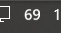
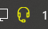

HeadsetControl-SystemTray
=====
A [Sapd/HeadsetControl](https://github.com/Sapd/HeadsetControl) system tray indicator for Windows.

For a list of supported devices please check [Sapd/HeadsetControl](https://github.com/Sapd/HeadsetControl).  

### Images
#### Over 25%


#### Under 25%


#### Over 15%


#### While charging


#### When disconnected/sleeping
The System tray icon hides itself, so it does't consumes space on your system tray.

### Requirements
[Sapd/HeadsetControl](https://github.com/Sapd/HeadsetControl) need to be installed and available on your PATH.
[Python3 And pip](https://www.python.org/downloads/)

### Installation
```
git clone https://github.com/zampierilucas/HeadsetControl-SystemTray.git
cd HeadsetControl-SystemTray

pip install .
```

### Usage
```
pythonw 
```
